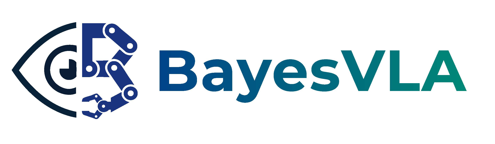
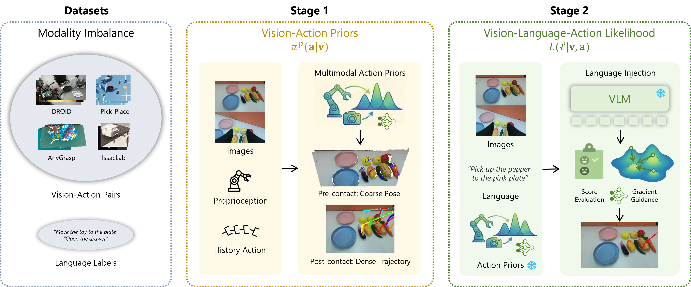

<div align="center">
<h2 style="border-bottom: none; margin-bottom: 0px ">Seeing to Act, Prompting to Specify:<br>A Bayesian Factorization of Vision Language Action Policy</h2>

[Kechun Xu](https://xukechun.github.io/) · [Zhenjie Zhu]() · [Anzhe Chen]() · [Shuqi Zhao](https://scholar.google.com/citations?user=IJ2t8pIAAAAJ&hl=en&oi=ao) · [Qing Huang]() · [Yifei Yang](https://scholar.google.com/citations?user=Pu9UyugAAAAJ&hl=en&oi=ao)<br>[Haojian Lu](https://scholar.google.com/citations?user=dNAbVgIAAAAJ&hl=en) · [Rong Xiong](https://scholar.google.com/citations?user=1hI9bqUAAAAJ&hl=en) · [Masayoshi Tomizuka](https://msc.berkeley.edu/people/tomizuka.html) · [Yue Wang](https://ywang-zju.github.io/)

<a href="https://arxiv.org/abs/2512.11218"></a>
<a href='https://xukechun.github.io/papers/BayesVLA/'></a>
<a href='https://www.bilibili.com/video/BV1eA63BHExy/'></a>

</div>

**TL; DR**: BayesVLA decomposes the policy into a vision-action prior and a language-conditioned likelihood. The vision-action prior leverages visual information for action generation (seeing to act), while the language-conditioned likelihood aligns these action priors with the language instruction (prompting to specify).

## 🏆 Highlights

🔍 **Key Findings**: modality imbalance in VLA data encourage "visual shortcut", degrading generalization in language condition

✨ **Key Insights**:
- **Bayesian factorization** to VA prior and VLA likelihood to structurally address the data imbalance during fine-tuning. The prior focuses on action modeling and generation, while the likelihood focuses on language grounding and alignment.

$$ 
\pi(\mathbf{a}\mid\mathbf{v},\ell) \propto\ \pi^{p}(\mathbf{a}\mid\mathbf{v}) L(\ell\mid\mathbf{v},\mathbf{a}) 
$$

- **Information-theoretical analysis** reveals that the small conditional entropy $H(\ell\mid\mathbf{v})$ is the key reason for shortcut learning on visual cues, motivating self-bulit benchmarks demonstrating diverse language conditions.

- **Contact-aware architecture** implementation: unified prior-likelihood formulation for both pre-contact and post-contact phases. 

## 🧩 Overview
https://github.com/user-attachments/assets/6455fd89-311d-414e-a112-3eb96878c46d

Given VLA datasets with modality imbalance, BayesVLA models the VLA policy using a prior and a likelihood, trained with **two stage** procedure: For stage 1, we train a prior model that takes in visual input to generate multimodal action distribution. Based on the prior, for stage 2, we train the likelihood model to further align the action priors with the language instruction.

<div align="center">
  
</div>

## 📘 Usage
### Data Preparation
* Droid

  We use the processed data from [cadence/droid_1.0.1](https://huggingface.co/datasets/cadene/droid_1.0.1) as it has camera extrinsic attached. Download it to anywhere you like, and make a symbolic link to it as `./data_raw/droid_1.0.1`. 
  ```bash
  bash scripts/data_preprocessing/process_libero.sh
  ```

* LIBERO

  Download the [LIBERO dataset](https://huggingface.co/datasets/yifengzhu-hf/LIBERO-datasets) and make a symbolink to `./data_raw/libero`.
  ```bash
  bash scripts/data_preprocessing/process_libero.sh
  ```


* Self-collected Datasets

  We upload the [processed datasets](https://huggingface.co/datasets/KechunXu1/BayesVLA), including [Pick-Place]() collected in IssacSim and [Articulated Object Manipulation]() collected in IssacLab, and [ALOHA]() collected in the real-world.


### Pre-training (Optional)
Note that pretraining is only for post-contact phase.
```bash
  bash scripts/postcontact/pretrain.sh
```

### Post-training
- Pre-contact Phase
  ```bash
  bash scripts/precontact/finetune.sh --config finetune_pp_arti
  ```
- Post-contact Phase
  ```bash
  # stage 0: va finetuning
  bash scripts/postcontact/finetune.sh --stage 0 --config finetune_pp_arti --va-name YOUR_VA_NAME
  # stage 1: vla finetuning
  bash scripts/postcontact/finetune.sh --stage 1 --config finetune_pp_arti --va-name YOUR_VA_NAME --vla-name YOUR_VLA_NAME
  ```

### Evaluation
* Launch the pyro4 naming server (something like roscore). 
  ```bash
  pyro4-ns
  ```
  By default the naming server runs on `localhost:9090`.

* Launch remote service of your fine-tuned model:
  ```bash
  python -m infer_utils.remote_service \
    --precontact_ckpt PRECONTACT_CKPT_PATH \
    --postcontact_ckpt POSTCONTACT_CKPT_PATH \ 
    --uri CUSTOM_URI_NAME
  ```

## 🤝 Acknowledgements
This projects builds upon [OpenPi](https://github.com/Physical-Intelligence/openpi) and [E2VLA](https://github.com/hhcaz/e2vla). We thank these teams for their open-source contributions.

## 📚 Citation

If you find this work useful, please consider citing:

```
@article{xu2025bayesvla,
      title={Seeing to Act, Prompting to Specify: A Bayesian Factorization of Vision Language Action Policy},
      author={Xu, Kechun and Zhu, Zhenjie and Chen, Anzhe and Zhao, Shuqi and Huang, Qing and Yang, Yifei and Lu, Haojian and Xiong, Rong and Tomizuka, Masayoshi and Wang, Yue},
      journal={arXiv preprint arXiv:2512.11218},
      year={2025}
    }
```

